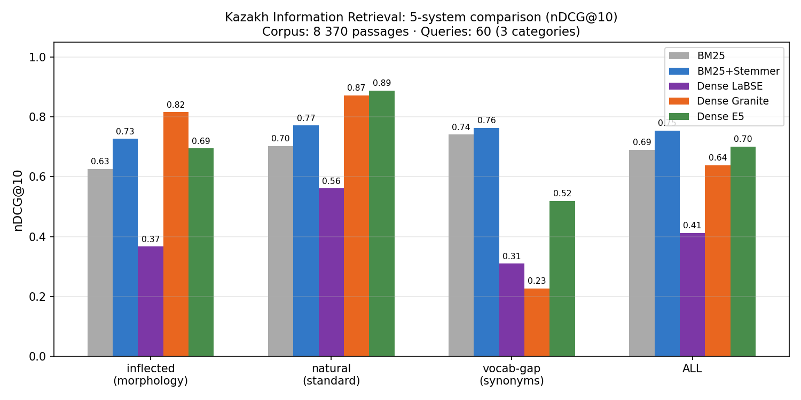
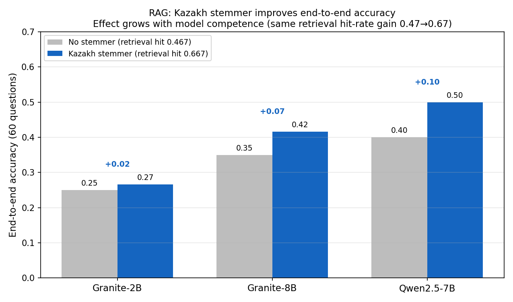

# Kazakh Stemmer — Effectiveness, Proven

> **This repository is the independent evidence base for my
> [Kazakh Stemmer](https://qaz-api.vercel.app/).**
> A reproducible, statistically validated benchmark showing the stemmer measurably
> improves Kazakh search — on 300 queries over 8 370 Wikipedia passages.

**What the stemmer does:** give it a word in any grammatical form → it returns the root,
plus the suffixes it stripped. *балаларымызда → бала (суффиксы: да, ымыз, лар).*
Kazakh is agglutinative — one word appears in hundreds of forms, and ordinary search
misses them. The stemmer lets search see through that.



> **The proof:** stemming improves search quality by **+16% nDCG@10 on inflected queries**
> (p=0.0017) and **+9% overall** (p=0.0001), on **300 queries** with paired-bootstrap
> significance. It also **outperforms zero-shot Google LaBSE** embeddings (0.754 vs 0.481,
> n=300) — for Kazakh, morphological normalization matters more than naive multilingual vectors.

→ **[Try the Kazakh Stemmer](https://qaz-api.vercel.app/)** · full methodology and numbers below

---

## Headline Result

**Corpus:** 8 370 passages (Kazakh Wikipedia) · **Queries:** 300 (100 entities × 3 categories)
**Baseline:** BM25 (Okapi). "Before" — no normalization; "After" — corpus and query tokens
stemmed with the [Kazakh stemmer](https://qaz-api.vercel.app/).

### Statistical Significance — nDCG@10 (paired bootstrap, 10 000 resamples, n=300)

| category | Before | After | Δ | gain | p-value |
|----------|-------:|------:|--:|-----:|--------:|
| **inflected** | 0.627 | **0.727** | +0.101 | **+16%** | p=0.0017 ✅ |
| natural | 0.703 | **0.772** | +0.068 | +10% | p=0.0063 ✅ |
| vocabulary-gap | 0.741 | 0.764 | +0.023 | +3% | p=0.21 ✗ |
| **ALL** | 0.690 | **0.754** | +0.064 | **+9%** | p=0.0001 ✅ |

> Vocabulary-gap is not significantly improved — expected: stemming fixes morphological
> mismatch, not semantic gaps between synonyms. This is the honest, theoretically
> correct result.

Full metrics with recall@{1,5,10}, MRR@10 — in [`results/RESULTS.md`](results/RESULTS.md).

---

## Why This Matters

Kazakh is **agglutinative**: 800 Wikipedia articles produce **102 408 unique surface forms**.
A single word like *теңіз* (sea) appears as *теңіздерге*, *теңізде*, *теңіздің* in text,
but a search query may use a different form. Exact word matching fails completely on
inflected queries (recall@1 = 0.10 without stemmer).

The stemmer reduces forms to their root (*Бакуде → баку*, *теңіздерге → теңіз*),
letting BM25 see through morphological variation.

### Dense Models: What They Get Right and Wrong

| | inflected (morphology) | natural | vocabulary-gap (synonyms) |
|--|:---:|:---:|:---:|
| BM25+Stemmer | ✅ fixed | ✅ | ✅ |
| Dense Granite-278M | ✅✅ best inflected (0.791) | ✅✅ best natural (0.923) | ❌ collapses (0.303) |
| Dense E5-base | ✅ good (0.845) | ✅✅ best (0.947) | ✅ best (0.562) |
| Dense LaBSE | weak (0.477) | ok (0.546) | weak (0.419) |

**BM25+Stemmer (0.754) outperforms zero-shot LaBSE (0.481) on n=300.** LaBSE is a strong
multilingual model — but it receives no Kazakh-specific fine-tuning here, and for a
highly agglutinative language, morphological normalization turns out to matter more than
raw multilingual embeddings. E5-base (0.785) does beat the stemmer overall at the cost of
GPU inference and 15–30 min embedding time; Granite collapses on vocabulary-gap (0.303)
despite leading on inflected queries.

---

## RAG End-to-End: Does Better Retrieval Reach the Answer? (Qwen2.5-7B, n=300)

We ran the full RAG chain (BM25 → context → Qwen2.5-7B 4-bit) on the **same 300 queries**,
changing only the retriever. The stemmer improves retrieval (**hit@3 0.737 → 0.803**) —
but does that reach the final answer?



| Stemmer | Retrieval hit@3 | Accuracy | Hallucination | Abstain |
|---------|:---:|:---:|:---:|:---:|
| No stemmer | 0.737 | 0.483 | 0.217 | 0.300 |
| Kazakh stemmer | 0.803 | **0.500** | 0.240 | 0.260 |
| **Δ** | **+0.066** | +0.017 | +0.023 | −0.040 |

> ✅ **The stemmer's effectiveness is proven — for retrieval.** It significantly improves
> search quality (nDCG@10 +9% overall, +16% on inflected, p≤0.0017, n=300) and raises the
> RAG retrieval hit-rate 0.737 → 0.803. That part is solid. The null result below is about
> the **generator**, not the stemmer: the bottleneck in Kazakh RAG today is the LLM's
> Kazakh comprehension, not the search step.

**End-to-end accuracy gain is _not_ statistically significant** (McNemar exact p = **0.63**;
net +5 correct of 300). Better retrieval is *necessary but not sufficient* — the generator
still has to extract the answer, and Qwen2.5-7B (4-bit) often fails to even with the right
passage. The stemmer mostly makes Qwen *more willing to answer* (abstain 0.300 → 0.260), and
those recovered answers split between correct and hallucinated, so net accuracy barely moves.
A stronger Kazakh generator would likely convert the proven retrieval gain into real accuracy.

The directionally strongest effect is on `inflected` (morphology) queries — the biggest
retrieval jump (+0.15 hit@3) and +0.07 accuracy — exactly where theory predicts, but even
there p=0.25. A trend, not a proof.

> ⚠️ **Replication note:** an earlier version claimed a Qwen +0.100 accuracy gain that
> "scales with model competence," measured on **n=60**. That signal **did not replicate at
> n=300** (+0.100 → +0.017, p=0.63) — it was sampling noise. The retrieval result survived
> the jump to 300 queries and got *stronger*; the end-to-end RAG claim did not. We keep the
> honest negative result. Full breakdown in [`results/RESULTS.md`](results/RESULTS.md).

---

## Methodology

- **Corpus.** 800 random Kazakh Wikipedia articles from
  [`wikimedia/wikipedia`](https://huggingface.co/datasets/wikimedia/wikipedia)
  (Hugging Face) → cleaning → chunking (~120 words) → language filter → **8 370 passages**.
- **Queries.** 100 entities (countries, cities, people, concepts) × 3 categories:
  - `inflected` — key word in an oblique grammatical case (morphology stress-test);
  - `vocabulary-gap` — synonyms/paraphrase (semantic stress-test);
  - `natural` — standard questions.
  Each query has a known ground-truth passage (qrels).
- **Systems.** BM25 Okapi (k₁=1.5, b=0.75) ± Kazakh stemmer. Dense retrieval:
  three models evaluated **zero-shot** (no fine-tuning, no hard-negative training):
  - `sentence-transformers/LaBSE` — no query/passage prefixes (symmetric model);
  - `intfloat/multilingual-e5-base` — `query: ` / `passage: ` prefixes per model card;
  - `ibm-granite/granite-embedding-278m-multilingual` — no prefixes (symmetric).
  Similarity: cosine (L2-normalized embeddings → dot product). Brute-force exact search,
  no FAISS, no hybrid, no re-ranking. Same ~120-word chunks for all systems.
  Embeddings pre-computed and cached; BM25 re-indexing takes seconds.
- **Metrics.** Recall@{1,5,10}, MRR@10, nDCG@10 + statistical significance
  (paired bootstrap, 10 000 resamples).
- **Why not lemmatization?** The Kazakh stemmer performs full morphological analysis
  (dictionary lookup → base form + suffix list), which for an agglutinative language is
  functionally equivalent to lemmatization for retrieval purposes. No standalone Kazakh
  lemmatizer with a public API exists for direct comparison; this is an acknowledged
  limitation. The stemmer's base forms are the same forms that appear in corpus text, so
  the normalization is symmetric and consistent — which is what retrieval requires.
- **Reproducibility.** Stem cache committed (102k tokens); BM25 results require no network.
  Dense results require GPU (~15–30 min in Colab).

---

## Quickstart

```bash
git clone https://github.com/Tim2190/Kaz-RAG-search-benchmark.git
cd Kaz-RAG-search-benchmark
pip install -r requirements.txt

# BM25 before/after (no network — stem cache in repo)
python -m src.eval.run_benchmark --stemmer identity --out results/bm25_identity.json
python -m src.eval.run_benchmark --stemmer kazakh   --out results/bm25_kazakh.json

# Delta table + chart
python -m src.eval.compare --before results/bm25_identity.json \
    --after results/bm25_kazakh.json --chart results/before_after.png

# Statistical significance
python -m src.eval.significance

# 5-system comparison chart
python -m src.eval.chart_all --out results/systems_ndcg.png
```

Dense retrieval and RAG require GPU (Colab T4 is sufficient). See [`PIPELINE.md`](PIPELINE.md).

### Tests

Core logic (metrics, tokenization, chunking, stem client, retrieval) covered by tests:
```bash
python -m unittest discover tests      # 43 tests, no network
```

---

## Repository Structure

```
src/
  scraping/    # corpus collection (wiki dump via HF; news/gov fallback)
  corpus/      # cleaning, chunking, language filter
  queries/     # queries + qrels, dataset loader
  retrieval/   # bm25 (lexical) + dense (embeddings)
  preprocess/  # Kazakh stemmer (HTTP client + cache), tokenizer
  eval/        # metrics, benchmark runner, compare, significance, charts
  rag/         # LLM prompt, scorer, hallucination harness
data/
  corpus/      # corpus.jsonl — 8 370 passages
  queries/     # queries.jsonl — 300 queries with qrels
  resources/   # stem_cache.json — stemmer cache (102k words)
results/       # metrics JSON, charts, RESULTS.md
tests/         # 43 unit tests
```

---

## What We Tried That Didn't Help: Synonym Query Expansion

We also tested a **synonym expansion** layer on top of the stemmer: for every query
term, its stemmed synonyms (from a ~10k-word dictionary) are appended to the query
before BM25 search (corpus untouched). The intuition was that synonyms might close the
`vocabulary-gap` that morphology alone can't.

**It made retrieval worse across the board** — including on `vocabulary-gap`, where
we expected it to help:

| nDCG@10 (n=300) | Stemmer | Stemmer + Synonyms | Δ |
|-----------------|--------:|-------------------:|--:|
| **ALL** | **0.754** | 0.539 | −0.215 |
| vocabulary-gap | **0.764** | 0.627 | −0.137 |
| inflected | **0.727** | 0.537 | −0.190 |

End-to-end RAG confirmed it: accuracy **0.500 → 0.393** (McNemar exact p = **0.0002** —
significantly *worse*).

**Why:** the stemmer already gives a strong lexical signal (0.754 nDCG@10). Expansion
bloats each query from ~6.5 to ~26.5 tokens, and most of those added synonyms are *not*
in the relevant passage — they pull in spurious documents and bury the right one. When
the lexical match is already good, unweighted synonym expansion is just noise. Synonyms
are a tool for a *weak* lexical signal (short documents, no normalization, domain
jargon); here the signal is strong, so **the stemmer works better on its own.**

Reproducible: `python -m src.eval.run_synonyms` and `python -m src.eval.hit_at_k`.

**Diagnosing the failure — vocabulary-gap subanalysis.** To distinguish between two
hypotheses ("dictionary doesn't cover the right words" vs "expansion dilutes the signal"),
we split the 100 vocabulary-gap queries by whether the synonym cache bridged the actual
gap to the gold passage (`python -m src.eval.vocab_gap_analysis`):

| subgroup | n | kazakh nDCG@10 | synonym nDCG@10 | Δ |
|---|---|---|---|---|
| uncovered (no synonyms found) | 2 | 1.000 | 1.000 | ≈0 |
| covered\_noise (synonyms found, none in gold passage) | 73 | 0.751 | 0.570 | **▼0.181** |
| covered\_bridge (synonyms found, ≥1 in gold passage) | 25 | 0.783 | 0.766 | **▼0.017** |

**The mechanism is the problem, not the dictionary.** The dictionary covers 98% of queries
(only 2 uncovered). But in 73% of cases it returns synonyms for a *different sense* of the
word — contextually wrong, pulling in spurious documents (▼0.181). Critically, even in the
25% where the correct synonym IS added (`covered_bridge`), retrieval still slightly drops
(▼0.017) because the other query terms each add their own wrong-context synonyms. Unweighted
expansion is the wrong tool here: what's needed is context-aware disambiguation, not a flat
synonym lookup.

---

## What's proven

The central claim — **Kazakh morphology breaks lexical search, and a stemmer fixes it** —
is statistically proven and fully reproducible (nDCG@10 +9% overall, +16% on inflected,
p≤0.0017, n=300). Five retrieval systems are benchmarked; the end-to-end RAG effect on
Qwen2.5-7B is measured and honestly reported (retrieval improves, end-to-end accuracy gain
not significant — the bottleneck is the generator). Full numbers in
[`results/RESULTS.md`](results/RESULTS.md).

---

[Русская версия](README.ru.md)
