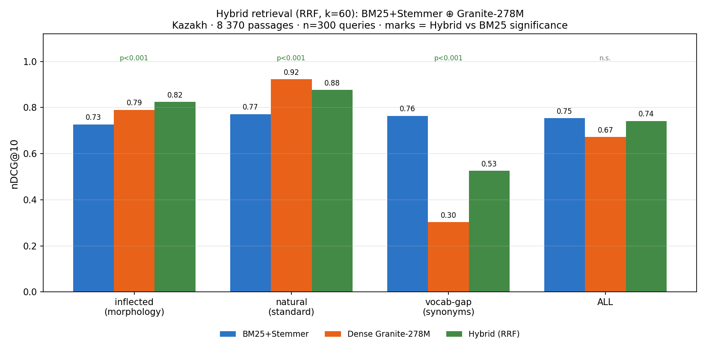

# Results: Kazakh IR Benchmark — 5-System Comparison

**Corpus:** 8 370 passages (Kazakh Wikipedia) · **Queries:** 300 (100 entities × 3 categories)

## Systems

| # | System | Description |
|---|--------|-------------|
| 1 | **BM25** | Lexical baseline, no normalization |
| 2 | **BM25 + Kazakh Stemmer** | Same BM25, corpus and queries stemmed |
| 3 | **Dense LaBSE** | `sentence-transformers/LaBSE`, multilingual |
| 4 | **Dense Granite** | `ibm-granite/granite-embedding-278m-multilingual` |
| 5 | **Dense E5** | `intfloat/multilingual-e5-base` |

---

## Main Result: nDCG@10 (n=300)

| System | inflected | natural | vocab-gap † | **ALL** |
|--------|----------:|--------:|----------:|--------:|
| BM25 | 0.627 | 0.703 | 0.741 | 0.690 |
| BM25 + Stemmer | 0.727 | 0.772 | **0.764** | 0.754 |
| Dense LaBSE | 0.477 | 0.546 | 0.419 | 0.481 |
| Dense Granite R1 | 0.791 | 0.923 | 0.303 | 0.672 |
| Dense Granite R2-97M | 0.711 | 0.880 | 0.175 | 0.589 |
| Dense Granite R2-311M | 0.791 | 0.924 | 0.263 | 0.659 |
| Dense E5 | 0.845 | 0.947 | 0.562 | 0.785 |
| Dense kazakh-e5 | 0.836 | 0.909 | 0.497 | 0.747 |
| Dense Jina v3 | 0.910 | **0.957** | 0.596 | 0.821 |
| **Dense BGE-M3** | **0.948** | **0.977** | **0.672** | **0.866** |
| Dense Nomic v1.5 | 0.144 | 0.297 | 0.071 | 0.171 |
| Dense Qwen3-0.6B | 0.792 | 0.927 | 0.352 | 0.690 |
| Dense Cohere embed-v4.0 | 0.864 | 0.965 | 0.570 | 0.800 |
| Dense KazEmbed-V5 | 0.778 | 0.865 | 0.284 | 0.642 |
| Hybrid ⊕ kazakh-e5 | 0.862 | 0.869 | 0.694 | 0.808 |
| Hybrid ⊕ Granite R1 | 0.824 | 0.877 | 0.525 | 0.742 |
| Hybrid ⊕ Granite R2-311M | 0.821 | 0.894 | 0.504 | 0.740 |
| Hybrid ⊕ Granite R2-97M | 0.779 | 0.869 | 0.438 | 0.695 |

> † **Caveat on the `vocab-gap` column.** Despite its name, this Wikipedia category was
> found to have the *highest* query↔gold lexical overlap of the three (≈0.56, vs 0.51
> natural / 0.47 inflected) — the Claude-generated "encyclopedic riddle" queries
> unintentionally reused key terms from the gold passage. So BM25+stemmer leading this
> column (0.764) reflects **strong lexical signal, not closing a semantic gap**. The genuine
> low-overlap test is the Akorda `low_overlap` category (≈0.32 overlap), where Jina v3
> (0.546) and e5 (0.413) beat BM25+stemmer (0.332) as expected — see
> [`akorda/AKORDA_RESULTS.md`](akorda/AKORDA_RESULTS.md). This was first documented there.

**Bold** = best in column. **BGE-M3 is the strongest single system overall (ALL=0.866)**,
significantly above Jina v3 (Δ=+0.045, p=0.0001), E5 (Δ=+0.081, p<0.0001), and
BM25+stemmer (Δ=+0.111, p<0.0001), paired bootstrap n=300. BGE-M3 also leads on
every individual category and is the only dense model to top the Hybrid ⊕ kazakh-e5
(0.808) without requiring fusion. BGE-M3 shares the same XLM-R tokenizer (250 002 tokens,
fertility=1.81) as E5 and Jina v3 — its gain is purely semantic/training, not tokenizer.
**Nomic v1.5 (0.171) is the weakest dense model tested** — its English BERT WordPiece
tokenizer (30 522 tokens) has no Kazakh-specific Cyrillic coverage; Kazakh-specific
characters map entirely to `[UNK]` (see `model-reports/nomic-v1.5.md`). Full metrics
and significance in [PREPRINT2.md](../PREPRINT2.md).

## Full Metrics Tables (n=300)

### BM25 — n=300

| category | recall@1 | recall@5 | recall@10 | mrr@10 | ndcg@10 |
|----------|--------:|---------:|----------:|-------:|--------:|
| inflected | 0.49 | 0.71 | 0.76 | 0.584 | 0.627 |
| natural | 0.53 | 0.82 | 0.87 | 0.649 | 0.703 |
| vocabulary-gap | 0.60 | 0.84 | 0.86 | 0.701 | 0.741 |
| **ALL** | 0.54 | 0.79 | 0.83 | 0.645 | 0.690 |

### BM25 + Stemmer — n=300

| category | recall@1 | recall@5 | recall@10 | mrr@10 | ndcg@10 |
|----------|--------:|---------:|----------:|-------:|--------:|
| inflected | 0.59 | 0.82 | 0.84 | 0.690 | 0.727 |
| natural | 0.61 | 0.88 | 0.92 | 0.723 | 0.772 |
| vocabulary-gap | 0.61 | 0.84 | 0.92 | 0.715 | 0.764 |
| **ALL** | 0.60 | 0.85 | 0.89 | 0.709 | 0.754 |

### Dense LaBSE — n=300

| category | recall@1 | recall@5 | recall@10 | mrr@10 | ndcg@10 |
|----------|--------:|---------:|----------:|-------:|--------:|
| inflected | 0.34 | 0.54 | 0.64 | 0.426 | 0.477 |
| natural | 0.35 | 0.66 | 0.78 | 0.473 | 0.546 |
| vocabulary-gap | 0.24 | 0.52 | 0.61 | 0.359 | 0.419 |
| **ALL** | 0.31 | 0.57 | 0.68 | 0.419 | 0.481 |

### Dense Granite — n=300

| category | recall@1 | recall@5 | recall@10 | mrr@10 | ndcg@10 |
|----------|--------:|---------:|----------:|-------:|--------:|
| inflected | 0.64 | 0.91 | 0.92 | 0.748 | 0.791 |
| natural | 0.88 | 0.95 | 0.97 | 0.909 | 0.923 |
| vocabulary-gap | 0.18 | 0.38 | 0.43 | 0.262 | 0.303 |
| **ALL** | 0.57 | 0.75 | 0.77 | 0.639 | 0.672 |

### Dense E5 — n=300

| category | recall@1 | recall@5 | recall@10 | mrr@10 | ndcg@10 |
|----------|--------:|---------:|----------:|-------:|--------:|
| inflected | 0.71 | 0.96 | 0.96 | 0.806 | 0.845 |
| natural | 0.88 | 1.00 | 1.00 | 0.929 | 0.947 |
| vocabulary-gap | 0.39 | 0.67 | 0.73 | 0.508 | 0.562 |
| **ALL** | 0.66 | 0.88 | 0.90 | 0.748 | 0.785 |

### Dense BGE-M3 — n=300

| category | recall@1 | recall@5 | recall@10 | mrr@10 | ndcg@10 |
|----------|--------:|---------:|----------:|-------:|--------:|
| inflected | 0.88 | 0.99 | 1.00 | 0.931 | 0.948 |
| natural | 0.94 | 1.00 | 1.00 | 0.968 | 0.977 |
| vocabulary-gap | 0.50 | 0.78 | 0.84 | 0.618 | 0.672 |
| **ALL** | 0.77 | 0.92 | 0.95 | 0.839 | 0.866 |

BGE-M3 (`BAAI/bge-m3`) is the strongest single model on Wikipedia nDCG@10 (0.866), significantly
above Jina v3 (Δ=+0.045, p=0.0001), E5 (Δ=+0.081, p<0.0001), and BM25+stemmer
(Δ=+0.111, p<0.0001), paired bootstrap 10 000 resamples. Uses the same XLM-R vocabulary
(250 002 tokens, fertility 1.81) as E5 and Jina v3 — gain is architectural/training, not
tokenizer. See `model-reports/bge-m3.md`.

### Dense Nomic v1.5 — n=300

| category | recall@1 | recall@5 | recall@10 | mrr@10 | ndcg@10 |
|----------|--------:|---------:|----------:|-------:|--------:|
| inflected | 0.09 | 0.17 | 0.22 | 0.121 | 0.144 |
| natural | 0.18 | 0.36 | 0.43 | 0.256 | 0.297 |
| vocabulary-gap | 0.04 | 0.09 | 0.12 | 0.057 | 0.071 |
| **ALL** | 0.10 | 0.21 | 0.26 | 0.145 | 0.171 |

Nomic v1.5 uses `nomic-bert-2048` with an English BERT WordPiece vocabulary (30 522 tokens).
Kazakh-specific Cyrillic characters (ә, і, ң, ғ, ү, ұ, қ, ө, һ) are entirely out-of-vocabulary
and tokenize as `[UNK]`, making query and document representations effectively random.
Significantly below every other model (vs e5: Δ=−0.614, p<0.001; vs BM25+stemmer: Δ=−0.583,
p<0.001). See `model-reports/nomic-v1.5.md`.

### Dense Qwen3-0.6B — n=300

| category | recall@1 | recall@5 | recall@10 | mrr@10 | ndcg@10 |
|----------|--------:|---------:|----------:|-------:|--------:|
| inflected | 0.65 | 0.89 | 0.92 | 0.751 | 0.792 |
| natural | 0.87 | 0.97 | 0.98 | 0.910 | 0.927 |
| vocabulary-gap | 0.23 | 0.43 | 0.47 | 0.313 | 0.352 |
| **ALL** | 0.58 | 0.76 | 0.79 | 0.658 | 0.690 |

Qwen3-Embedding-0.6B is a LLM-based dense model (Alibaba). On Wikipedia it matches BM25
(0.690 ≈ 0.690) but is significantly below BM25+stemmer (Δ=−0.064, p=0.010) and every
stronger dense model (vs E5: Δ=−0.094, p<0.001; vs Jina v3: Δ=−0.131, p<0.001;
vs BGE-M3: Δ=−0.175, p<0.001). Its vocabulary-gap score (0.352) is the third weakest
dense result after Nomic (0.071) and Granite R2-97M (0.175), consistent with the
highest sub-word fertility of all tested models (6.20 sub-words/word on Kazakh).
See `model-reports/qwen3-embed-0.6b.md`.

### Dense Cohere embed-v4.0 — n=300

| category | recall@1 | recall@5 | recall@10 | mrr@10 | ndcg@10 |
|----------|--------:|---------:|----------:|-------:|--------:|
| inflected | 0.76 | 0.93 | 0.96 | 0.833 | 0.864 |
| natural | 0.93 | 0.99 | 0.99 | 0.956 | 0.965 |
| vocabulary-gap | 0.38 | 0.66 | 0.78 | 0.504 | 0.570 |
| **ALL** | 0.69 | 0.86 | 0.91 | 0.764 | 0.800 |

Cohere `embed-v4.0` is an API-only multilingual embedder (Cohere, 2025) marketed for
cross-lingual retrieval (100+ languages). On Wikipedia it is the 3rd-strongest single
system (0.800): statistically tied with Jina v3 (Δ=+0.021, p=0.104) and E5 (Δ=−0.015,
p=0.179), significantly beating BM25+stemmer (Δ=+0.046, p=0.028) and Qwen3 (Δ=+0.110,
p<0.001), but significantly below BGE-M3 (Δ=−0.066, p<0.001). Note: its Wikipedia
strength does **not** carry to Akorda, where it collapses to 0.367 (the largest
cross-domain drop in the benchmark, −0.433) — its tokenizer fragments Kazakh at the byte
level identically to Qwen3 (fertility 6.20). See `model-reports/cohere-embed-v4.md`.

### Dense KazEmbed-V5 — n=300

| category | recall@1 | recall@5 | recall@10 | mrr@10 | ndcg@10 |
|----------|--------:|---------:|----------:|-------:|--------:|
| inflected | 0.56 | 0.94 | 0.96 | 0.717 | 0.778 |
| natural | 0.73 | 0.95 | 0.98 | 0.827 | 0.865 |
| vocabulary-gap | 0.15 | 0.30 | 0.46 | 0.231 | 0.284 |
| **ALL** | 0.48 | 0.73 | 0.80 | 0.592 | 0.642 |

`Nurlykhan/kazembed-v5` is fine-tuned from `intfloat/multilingual-e5-base` on Kazakh
retrieval data (KazQAD + Powerful-Kazakh-Dialogue, 61 255 pairs). Despite a claimed +2.1%
MRR improvement over e5-base on KazQAD, it is **significantly below the base e5 model on
this benchmark** (Δ=+0.142, p<0.001) and below every stronger system: BGE-M3
(Δ=+0.223, p<0.001), Jina v3 (Δ=+0.179, p<0.001), Cohere (Δ=+0.158, p<0.001),
BM25+Stemmer (Δ=+0.112, p<0.001), and kazakh-e5 (Δ=+0.105, p<0.001 — a different
Kazakh e5 fine-tune that also outperforms kazembed-v5 significantly). kazembed-v5 is
**statistically tied with Granite R2-311M** (Δ=+0.017, p=0.153, n.s.) and significantly
above Granite R2-97M (Δ=−0.054, p=0.002) and Nomic (p<0.001). The vocabulary-gap score
(0.284) is particularly weak — lower than every system except Nomic (0.071) and Granite
R2-97M (0.175). The in-domain KazQAD gain does not transfer to this benchmark.
See `model-reports/kazembed-v5.md`.

---

## Statistical Significance (BM25 Before → After Stemmer)

Paired bootstrap, 10 000 resamples, **n=300 queries**.

| category | Before | After | Δ | gain | p-value |
|----------|-------:|------:|--:|-----:|--------:|
| **inflected** | 0.627 | **0.727** | +0.101 | **+16%** | p=0.0017 ✅ |
| natural | 0.703 | **0.772** | +0.068 | +10% | p=0.0063 ✅ |
| vocabulary-gap | 0.741 | 0.764 | +0.023 | +3% | p=0.21 ✗ |
| **ALL** | 0.690 | **0.754** | +0.064 | **+9%** | p=0.0001 ✅ |

**vocabulary-gap is not significant** — expected and theoretically correct. Stemming
fixes morphological mismatch; it cannot bridge semantic gaps (synonyms, paraphrases).
Vocabulary-gap requires semantic retrieval (dense embeddings or query expansion).

---

## RAG End-to-End: Does Better Retrieval Reach the Answer? (Qwen2.5-7B, n=300)

We ran the full RAG chain (BM25 retrieval → context → Qwen2.5-7B, 4-bit) on the
**same 300 queries**, swapping only the retriever: BM25 without vs. with the Kazakh
stemmer. The stemmer does improve retrieval — **hit@3 rises 0.737 → 0.803**. The
question is whether that propagates into a measurably better final answer.


| Stemmer | Retrieval hit@3 | Accuracy | Hallucination | Abstain |
|---------|----------------:|--------:|-------------:|--------:|
| identity (no stemmer) | 0.737 | 0.483 | 0.217 | 0.300 |
| kazakh stemmer | 0.803 | 0.500 | 0.240 | 0.260 |
| **Δ** | **+0.066** | **+0.017** | +0.023 | −0.040 |

**McNemar exact test on per-query accuracy: p = 0.625 — not significant.**
The +0.017 accuracy change is 36 queries that became correct vs. 31 that became wrong
(net +5 of 300). Within the noise.

### Per-category breakdown (accuracy, McNemar)

| category | hit@3 (id→kk) | acc (id→kk) | gained | lost | McNemar p |
|----------|:-------------:|:-----------:|-------:|-----:|----------:|
| **inflected** | 0.64 → 0.79 | 0.41 → 0.48 | 17 | 10 | 0.25 ✗ |
| natural | 0.75 → 0.83 | 0.56 → 0.57 | 10 | 9 | 1.00 ✗ |
| vocabulary-gap | 0.82 → 0.79 | 0.48 → 0.45 | 9 | 12 | 0.66 ✗ |
| **ALL** | 0.74 → 0.80 | 0.483 → 0.500 | 36 | 31 | 0.63 ✗ |

### What this means (honest read)

> ✅ **The stemmer's effectiveness is proven — at the retrieval level.** It significantly
> improves search quality (nDCG@10 +9% overall, +16% on inflected, p≤0.0017, n=300) and
> raises the RAG retrieval hit-rate 0.737 → 0.803. The null result below is **not** evidence
> that the stemmer is useless — it isolates where the remaining bottleneck lives: the
> **generator**, not the retriever.

1. **The retrieval gain is real but does not produce a significant end-to-end accuracy
   gain on this model at n=300.** Better context is *necessary but not sufficient*: the
   generator also has to extract the answer from it, and Qwen2.5-7B frequently fails to
   (it abstains, or pulls the wrong fact from the right passage). A stronger Kazakh
   generator would likely convert the proven retrieval gain into real accuracy.

2. **The directionally strongest effect is exactly where theory predicts** — `inflected`
   queries (morphology), which see the biggest retrieval-hit jump (+0.15) and an accuracy
   gain of +0.07 (gained 17, lost 10). But even there p=0.25 — a trend, not a proof.

3. **Behaviour shift, not just accuracy:** the stemmer pushes Qwen out of abstention
   (abstain 0.300 → 0.260). Some of those recovered answers are correct, some become
   hallucinations (hallucination 0.217 → 0.240). Net accuracy barely moves. Better
   retrieval makes the model *more willing to answer*, not reliably *more correct*.

### ⚠️ Note on the earlier n=60 RAG numbers

A previous version of this section reported a Qwen accuracy gain of **+0.100** and a
"scales with model competence" pattern across Granite-2B/8B/Qwen — all measured on
**n=60, single run**. **That signal did not replicate at n=300** (+0.100 → +0.017,
p=0.63). It was sampling noise. This is precisely why we expanded the query set: the
retrieval result survived the jump to 300 queries (and got *stronger* statistically);
the end-to-end RAG claim did not. We keep the honest n=300 result. The exploratory
n=60 Granite-2B/8B runs remain in `results/rag_granite.json` / `rag_granite8b.json`
for reference, but we no longer draw a statistical claim from them.

---

## Hybrid Retrieval (RRF): Can BM25+Stemmer and Granite Be Combined? (n=300)

**Hypothesis (pre-registered, falsifiable).** The two best single channels fail in
different places: BM25+Stemmer fixes morphology but can't bridge synonyms; Granite-278M
is strong on semantics but collapses on vocabulary-gap (0.303). Fusing their *ranks* via
Reciprocal Rank Fusion (RRF, `score(d)=Σ 1/(k+rank)`, **k=60 fixed in advance**) should
give a retriever that is more robust across all three categories than either channel alone.

**Success criteria (set before running, both required):**
1. nDCG@10(Hybrid) ≥ max(BM25+Stemmer, Granite) on **ALL**;
2. on **vocabulary-gap**, Hybrid ≥ BM25+Stemmer (Granite must not drag fusion down).

Both channels were re-run on the **same 300 queries** (no n=60/n=300 mixing — the merge
script hard-fails if the query sets differ). Retrieval was not re-run for fusion; the
committed per-query rankings (`runs_bm25_kazakh.json`, `runs_dense_granite.json`) are
merged deterministically.



### nDCG@10 — three systems × four slices

| System | inflected | natural | vocab-gap | **ALL** |
|--------|----------:|--------:|----------:|--------:|
| BM25 + Stemmer | 0.727 | 0.772 | **0.764** | **0.754** |
| Dense Granite-278M | 0.791 | **0.923** | 0.303 | 0.672 |
| **Hybrid (RRF, k=60)** | **0.824** | 0.877 | 0.525 | 0.742 |

### Significance (paired bootstrap, 10 000 resamples, nDCG@10)

| slice | Hybrid − BM25 | p | Hybrid − Granite | p |
|-------|--------------:|--:|-----------------:|--:|
| inflected | **+0.097** | <0.0001 ✅ | +0.034 | 0.124 ✗ |
| natural | **+0.105** | <0.0001 ✅ | −0.047 | 0.032 |
| vocabulary-gap | **−0.239** | <0.0001 | **+0.223** | <0.0001 ✅ |
| **ALL** | −0.012 | 0.269 ✗ | **+0.070** | <0.0001 ✅ |

### Sensitivity to k (pre-registered k=60; sweep shown for honesty, *not* to pick a winner)

| k | inflected | natural | vocab-gap | ALL |
|---|----------:|--------:|----------:|----:|
| 10 | 0.841 | 0.885 | 0.603 | 0.776 |
| 30 | 0.822 | 0.880 | 0.546 | 0.749 |
| **60** | **0.824** | **0.877** | **0.525** | **0.742** |
| 100 | 0.818 | 0.873 | 0.516 | 0.736 |

> Note: at k=10 the **ALL** criterion would *pass* (0.776 ≥ 0.754). We do **not** report
> that as the result — k=60 was fixed before the experiment, exactly to avoid choosing k
> after seeing the numbers. Crucially, the **vocabulary-gap criterion fails at every k**
> (best 0.603 at k=10, still well below BM25's 0.764), so the verdict is robust to k.

### Verdict: hypothesis falsified ❌

**Both pre-registered criteria fail at k=60.** RRF fusion with Granite does **not** yield a
uniformly more robust retriever:

1. **ALL:** Hybrid 0.742 < BM25+Stemmer 0.754 (p=0.27, not significant — a wash, not a win).
2. **vocabulary-gap:** Hybrid 0.525 ≪ BM25+Stemmer 0.764 (−0.239, p<0.0001). Granite's
   collapse on synonyms (0.303) leaks straight through the fusion. **RRF cannot rescue a
   channel that is actively wrong on an entire category** — it averages the good ranks of
   BM25 with the bad ranks of Granite and lands in between.

**What *is* real (the honest positive sub-finding):**

- **On morphology (`inflected`), the Hybrid is the single best system of all — 0.824**,
  significantly beating BM25+Stemmer (+0.097, p<0.0001) and edging Granite (+0.034, n.s.).
  Where both channels are competent, fusion genuinely helps.
- **The Hybrid is far more robust than Granite alone** (vocab-gap 0.303 → 0.525), and it
  beats Granite overall (+0.070, p<0.0001). If your baseline is a dense model, wrapping it
  in BM25+Stemmer via RRF is a clear win.
- **But BM25+Stemmer alone remains the most balanced single system** — it never drops below
  0.727 on any slice. That balance is exactly what the fusion sacrifices.

**Takeaway for practitioners:** there is no free lunch from naive RRF here. Use the Hybrid
when morphology dominates your queries; use BM25+Stemmer alone when query types are mixed
and you can't tolerate a vocab-gap regression. A category-aware router (lexical for
synonyms, hybrid for morphology) would likely beat both — left as future work, *not*
claimed here.

---

## Synonym Query Expansion: Does Expanding Queries with Synonyms Help? (n=300)

**Motivation.** The Kazakh stemmer leaves vocabulary-gap queries statistically unimproved
(p=0.21, see §Statistical Significance). Can explicit synonym expansion bridge semantic gaps
where stemming cannot?

**Setup.** BM25 + Kazakh Stemmer baseline with query-side synonym expansion. For each query
stem, synonyms are fetched from a Kazakh synonym dictionary (736 unique query stems; 224 of
them — 30% — returned at least one synonym; cache committed at
`data/resources/synonym_cache.json`). Queries expand from an average of 6.5 to 26.5 tokens.
**Corpus is not touched** — only queries are expanded. Expansion is unweighted (all synonym
tokens receive the same BM25 weight as the original query tokens).

### nDCG@10 — BM25+Stemmer vs BM25+Synonym Expansion

| System | inflected | natural | vocab-gap | **ALL** |
|--------|----------:|--------:|----------:|--------:|
| BM25 + Kazakh Stemmer | 0.727 | 0.772 | **0.764** | **0.754** |
| BM25 + Synonym Expansion | 0.537 | 0.451 | 0.627 | 0.539 |
| **Δ** | **−0.190** | **−0.321** | **−0.137** | **−0.215** |

Synonym expansion hurts retrieval on every category. The hardest hit is `natural` (−0.321),
where queries already matched well lexically; flooding them with irrelevant synonyms pushes
spurious documents into the top ranks.

### Root cause: signal dilution, not dictionary gaps

We split vocabulary-gap queries into three subgroups to distinguish two hypotheses:

- **H1 "Dictionary doesn't cover the needed words"** → drop should be concentrated in `uncovered`
- **H2 "Expansion mechanism dilutes signal"** → drop should appear even in `covered_bridge`

| Subgroup | n (%) | BM25+Stemmer nDCG@10 | +Synonym nDCG@10 | Δ |
|----------|------:|--------------------:|----------------:|--:|
| uncovered (no synonyms found) | 2 (2%) | 1.000 | 1.000 | ≈ 0.000 |
| covered\_noise (synonyms found, none in gold passage) | 73 (73%) | 0.751 | 0.570 | ▼ 0.181 |
| covered\_bridge (synonyms found, ≥1 in gold passage) | 25 (25%) | 0.783 | 0.766 | ▼ 0.017 |

Even `covered_bridge` — where the dictionary found exactly the right bridge word — degrades
slightly (−0.017). **H2 is confirmed: the mechanism is the problem.** 73% of vocabulary-gap
queries receive contextually wrong synonyms (`covered_noise`), bloating the query from ~6.5
to ~26.5 tokens and flooding BM25 with noise signals. Even correct bridges (25% of queries)
provide minimal lift because the rest of the expanded query still carries noise.

### Verdict: hypothesis falsified ❌

Unweighted synonym expansion hurts a strong lexical baseline. The vocabulary-gap problem
requires smarter weighting (e.g., lower BM25 term weight for synonym tokens), hard negative
filtering, or semantic retrieval — not naive query concatenation.

> **Note on RAG synonym run (Colab, JSON not committed).** A full RAG chain
> (BM25+Synonym retrieval → Qwen2.5-7B, 4-bit, n=300) was also run. Accuracy dropped
> to 0.393 vs. 0.500 for the kazakh-stemmer baseline (McNemar p=0.0002 — significant
> degradation). This is consistent with the retrieval-level finding above: worse retrieval
> translates directly into worse end-to-end accuracy. The result JSON was not committed;
> re-run with `--synonym-runs` flag if needed (see Reproduction below).

### Reproduction (CPU only — synonym cache committed)

```bash
python -m src.eval.run_synonyms \
    --out results/bm25_synonym_300.json \
    --runs-out results/runs_bm25_synonym.json

python -m src.eval.vocab_gap_analysis \
    --kazakh-runs  results/runs_bm25_kazakh.json \
    --synonym-runs results/runs_bm25_synonym.json
```

---

## Key Findings

1. **Morphological blindness is real and measured on 300 queries.** BM25 on inflected
   queries (ndcg@10 = 0.627) significantly underperforms vs natural (0.703), p=0.0017.
   Kazakh's agglutinative morphology produces 102 408 unique surface forms from
   800 articles — exact word matching fails on morphological variants.

2. **Stemmer fixes it significantly:** +16% ndcg@10 on inflected (p=0.0017), +10% on
   natural (p=0.006), overall +9% (p=0.0001).

3. **Stemmer correctly does NOT fix vocabulary-gap** (p=0.21, not significant).
   This is the theoretically expected result: stemming reduces morphological variation
   but cannot bridge semantic gaps between synonyms. Dense retrieval is needed there.

4. **BM25+Stemmer beats Dense LaBSE on n=300** (0.754 vs 0.481 overall) — and beats it on
   every category. Naive multilingual embeddings (LaBSE) are weak for Kazakh; morphological
   normalization on a lexical index is far stronger.

5. **Dense Granite-278M is exceptional on morphology and natural queries** (inflected 0.791,
   natural 0.923) but **collapses on vocabulary-gap** (0.303) — no semantic bridging for
   synonyms despite strong dense performance elsewhere.

6. **Dense E5 is the best overall system on n=300** (0.785), and the best on inflected (0.845)
   and natural (0.947). BM25+Stemmer remains the most *balanced* system — best on
   vocabulary-gap (0.764) and never below 0.727 on any slice — while being fast, network-free
   and interpretable.

7. **RAG end-to-end (Qwen2.5-7B, n=300): better retrieval, but no significant accuracy
   gain.** The stemmer raises retrieval hit@3 0.737 → 0.803 (directly measured), yet
   end-to-end accuracy moves only 0.483 → 0.500 (McNemar p=0.63, not significant). Better
   context is necessary but not sufficient — the generator must also extract the answer.
   The directionally strongest effect is on `inflected` queries (+0.07 acc, p=0.25),
   consistent with the morphology mechanism, but still a trend, not a proof. *Honest
   negative result: the retrieval win does not automatically become an answer-quality win
   at this scale.*

8. **Hybrid (RRF, BM25+Stemmer ⊕ Granite, n=300): falsified — no uniform robustness win.**
   At the pre-registered k=60, the Hybrid is the single best system on `inflected`
   morphology (0.824, +0.097 vs BM25, p<0.0001) and is far more robust than Granite alone,
   but it **fails both success criteria**: on `vocabulary-gap` it drops to 0.525 (vs BM25's
   0.764, p<0.0001) because Granite's synonym collapse (0.303) leaks through the fusion, and
   on **ALL** it is a wash (0.742 vs 0.754, p=0.27). *Honest negative result: naive RRF
   cannot rescue a channel that is wrong on a whole category; BM25+Stemmer alone stays the
   most balanced single system.*

9. **Synonym query expansion (n=300): falsified — hurts all categories.** Unweighted query
   expansion via a Kazakh synonym dictionary (30% stem coverage) drops ALL nDCG@10 from 0.754
   to 0.539 (−0.215). Vocab-gap subanalysis confirms the mechanism is the problem: 73% of
   vocabulary-gap queries receive contextually wrong synonyms (`covered_noise`, −0.181), and
   even queries with a correct synonym bridge (`covered_bridge`, 25%) drop slightly (−0.017)
   because surrounding noise terms dilute the signal. RAG accuracy also drops significantly
   (0.500 → 0.393, McNemar p=0.0002 in Colab run). *Honest negative result: better vocabulary
   coverage does not help if synonym tokens are unweighted and contextually mismatched.*

---

## Reproduction

```bash
# Lexical (no network needed — stem cache committed)
python -m src.eval.run_benchmark --stemmer identity --out results/bm25_identity.json
python -m src.eval.run_benchmark --stemmer kazakh   --out results/bm25_kazakh.json
python -m src.eval.compare --before results/bm25_identity.json \
    --after results/bm25_kazakh.json --chart results/before_after.png
python -m src.eval.significance

# Dense, n=300 (requires GPU, downloads ~1–5 GB models)
python -m src.eval.run_dense --model granite --out results/dense_granite_300.json
python -m src.eval.run_dense --model labse   --out results/dense_labse_300.json
python -m src.eval.run_dense --model e5      --out results/dense_e5_300.json

# Regenerate all n=300 tables in this file from the JSON above (single source of truth)
python -m src.eval.gen_results_tables

# Multi-system chart
python -m src.eval.chart_all --out results/systems_ndcg.png

# Hybrid RRF (dump per-query rankings on the SAME 300 queries, then merge — CPU only)
python -m src.eval.run_benchmark --stemmer kazakh --top-k 100 \
    --runs-out results/runs_bm25_kazakh.json
python -m src.eval.run_dense --model granite --top-k 100 \
    --runs-out results/runs_dense_granite.json        # GPU for this dump
python -m src.eval.run_hybrid \
    --bm25-runs results/runs_bm25_kazakh.json \
    --granite-runs results/runs_dense_granite.json \
    --out results/hybrid_kazakh.json                  # CPU: merge + bootstrap + k-sweep
python -m src.eval.chart_hybrid --out results/systems_hybrid_ndcg.png

# RAG hallucination benchmark (GPU + Colab recommended)
python -m src.eval.run_rag --llm granite --top-k 3 --out results/rag_granite.json

# Synonym query expansion (CPU only — cache committed)
python -m src.eval.run_synonyms \
    --out results/bm25_synonym_300.json \
    --runs-out results/runs_bm25_synonym.json
python -m src.eval.vocab_gap_analysis \
    --kazakh-runs  results/runs_bm25_kazakh.json \
    --synonym-runs results/runs_bm25_synonym.json
```
